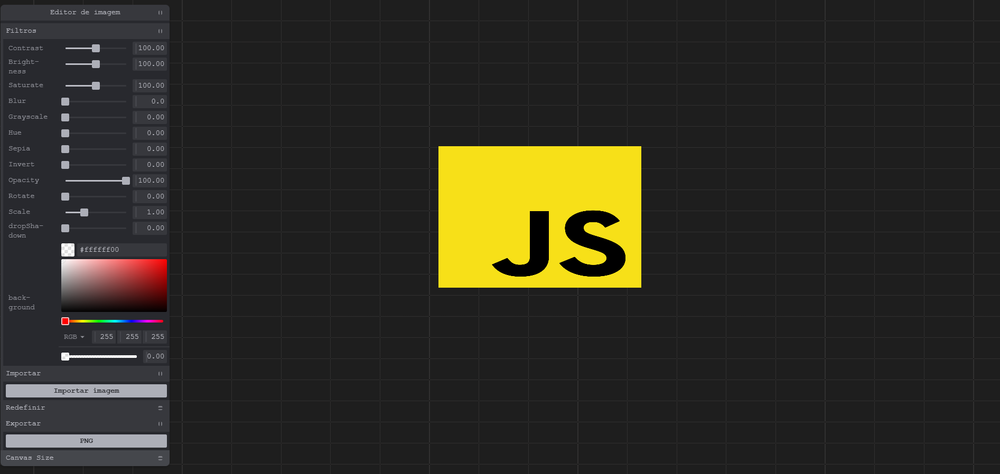

# 🖼️ Filtrozito - Editor de Imagens

Bem-vindo ao **Editor de Imagens Online**, uma aplicação web simples e poderosa que permite editar suas imagens diretamente do navegador, aplicando diversos filtros com apenas alguns cliques!



🔗 **Acesse agora**: [leonardo-ggomes.github.io/editor-img](https://leonardo-ggomes.github.io/editor-img/)

---

## 📑 Índice

- [🚀 Introdução](#-introdução)
- [✨ Recursos](#-recursos)
- [⚙️ Instalação](#-instalação)
- [🧑‍💻 Uso](#-uso)
- [🤝 Contribuidores](#-contribuidores)
- [📄 Licença](#-licença)

---

## 🚀 Introdução

O **Editor de Imagens Online** é uma ferramenta gratuita e de fácil uso para aplicar filtros e efeitos visuais em imagens. Ideal para quem precisa de uma edição rápida sem instalar programas pesados no computador.

---

## ✨ Recursos

- 🎨 **Filtros em tempo real**:
  - Brilho
  - Contraste
  - Saturação
  - Matiz
  - Desfoque
  - Sépia
  - Escala de cinza

- ⚡ **Visualização instantânea**
- 🧭 **Interface intuitiva**
- 🌐 **Compatível com navegadores modernos**
- 💾 **Download da imagem editada**

---

## ⚙️ Instalação

Para rodar localmente:

```bash
git clone https://github.com/leonardo-ggomes/editor-img.git
cd editor-img
```

Depois, basta abrir o arquivo `index.html` no navegador.

---

## 🧑‍💻 Uso

1. 📤 Carregue sua imagem
2. 🎚️ Ajuste os filtros conforme sua preferência
3. 👀 Veja as mudanças em tempo real
4. 💾 Salve a imagem editada

---

## 🤝 Contribuidores

- 👨‍💻 [Leonardo Gomes](https://github.com/leonardo-ggomes)

---

## 📄 Licença

Distribuído sob a licença MIT. Veja o arquivo [`LICENSE`](LICENSE) para mais detalhes.
